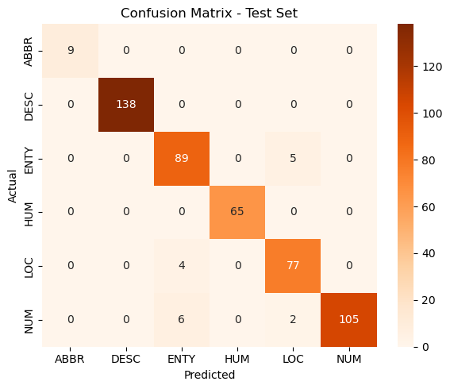
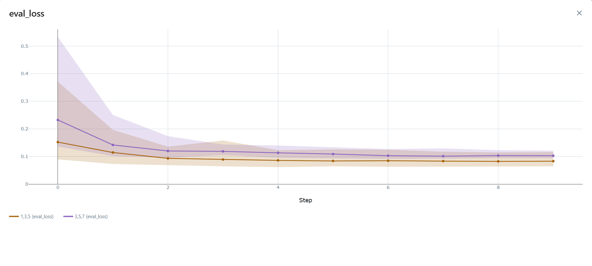
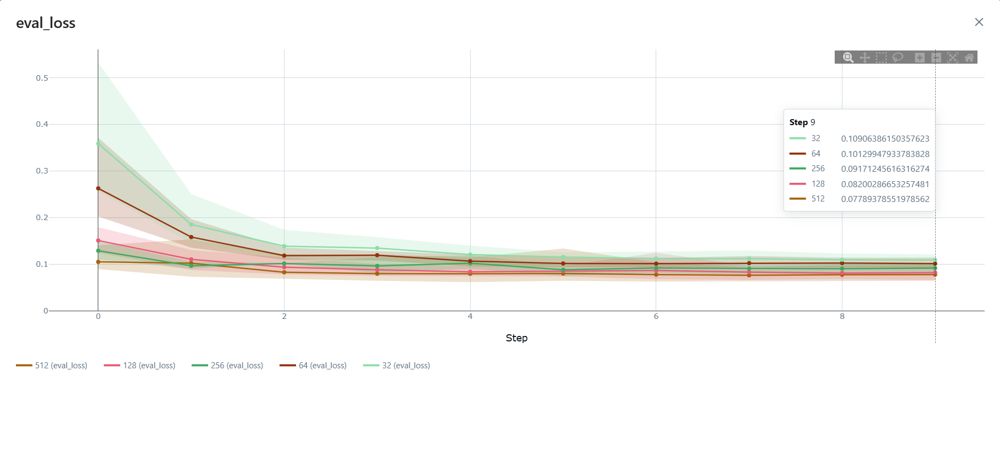
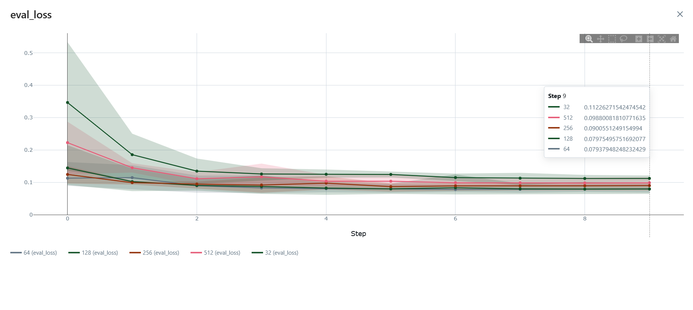

# Learning Question Classifiers

**A Modern Revisit to the TREC Dataset Using Deep Learning Approaches**

**Dataset**: [Link](https://cogcomp.seas.upenn.edu/page/resource_view/49) [Link](https://cogcomp.seas.upenn.edu/Data/QA/QC/)<br>
**Paper Reference**: [Li & Roth, 2002](https://cogcomp.seas.upenn.edu/page/publication_view/130)

## 1. Introduction

Question classification is a foundational task in natural language understanding, with applications in question answering systems, chatbots, and information retrieval. This project revisits the classic TREC dataset using modern deep learning models, starting with a convolutional baseline (TextCNN) and expanding to more complex architectures in subsequent phases. Our approach emphasizes rigorous experimentation, hyperparameter tuning, and semantic error analysis.

## 2. Experimental Setup

### 2.1 Data Preprocessing

We use the `TREC 6-way` classification dataset consisting of:

* 5,500 training questions
* 500 testing questions

#### Preprocessing Steps

* Duplicate removal from both training and test sets
* Tokenization and numerical encoding via Keras
* Padding sequences to fixed length
* 80/20 training-validation split for model tuning

### 2.2 Training Environment

* Framework: **PyTorch**
* Optimization Tools: **Optuna** (for hyperparameter tuning), **MLflow** (for experiment tracking)
* Hardware: **NVIDIA GeForce RTX 3060 (CUDA-enabled)**
* Objective: Minimize **validation loss**

## 3. Model1: TextCNN (Baseline)

The first model implemented is a multi-kernel convolutional neural network (TextCNN) inspired by [Kim (2014)](https://arxiv.org/abs/1408.5882). It captures n-gram level semantics through parallel convolutional filters of various sizes.

### 3.1 Best Trial via Optuna

After 25 tuning trials, the best configuration was:

```python
{
    'embedding_dim': 512, 
    'num_filters': 128, 
    'kernels': '1,3,5'
}
```

This architecture yielded the lowest validation loss: **0.0646**

### 3.2 Model Architecture

**Loss Function**: CrossEntropyLoss<br>
**Optimizer**: Adam (lr=0.001)

```python
TextCNN(
  (embedding): Embedding(8482, 512)
  (conv1): Conv1d(512, 128, kernel_size=(1,), padding=same)
  (conv2): Conv1d(512, 128, kernel_size=(3,), padding=same)
  (conv3): Conv1d(512, 128, kernel_size=(5,), padding=same)
  (fc): Linear(384 → 6)
)
```

### 3.3 Performance on Test Set

| Class   | Precision | Recall | F1-Score | Support |
|---------|-----------|--------|----------|---------|
| ABBR    | 1.00      | 1.00   | 1.00     | 9       |
| DESC    | 1.00      | 1.00   | 1.00     | 138     |
| ENTY    | 0.90      | 0.95   | 0.92     | 94      |
| HUM     | 1.00      | 1.00   | 1.00     | 65      |
| LOC     | 0.92      | 0.95   | 0.93     | 81      |
| NUM     | 1.00      | 0.93   | 0.96     | 113     |
|         |           |        |          |         |
| accuracy|           |        | 0.97     | 500     |
| macro avg | 0.97    | 0.97   | 0.97     | 500     |
| weighted avg | 0.97 | 0.97   | 0.97     | 500     |



### 3.4 Insights from Hyperparameter Tuning

#### Kernel Sizes

* Kernels `[1, 3, 5]` outperform `[3, 5, 7]`
* The 1-gram kernel captures strong lexical cues (e.g. "who" -> HUM, "where" -> LOC)



#### Embedding Dimensions

* Higher dimensions (up to 512) lead to better performance
* Suggests richer semantic representation helps in capturing question intent



#### Filter Counts

* 64 vs 128 filters perform similarly
* Adding more filters beyond 128 may yield diminishing returns



### 3.5 Semantic Error Analysis

Based on a semantic review of the misclassified samples, the errors generally fall into **four key categories**:

1. Overreliance on Surface-Level Keywords

CNNs capture local patterns (n-grams), but when questions use generic structures like:

* "What is the..." or "How many..."
* ...without strong class-indicative keywords (e.g., "who", "where", "how much"), the model may guess the most likely class seen during training—commonly ENTY.

> See Sample 4 ->  **NUM**, but predicted **ENTY** due to the abstract phrasing and missing numeric hints.

2. Named Entity Confusion

The presence of **named places or countries** (e.g., "New York", "Minnesota", "Madrid", "Canada") misleads the model into predicting **LOC**, even when the actual question is about:

* sales tax (NUM)
* energy output (ENTY)
* population size (NUM)

> The model associates geographic entities with **LOC**, regardless of the actual intent of the question.

3. Information Loss via `<UNK>` Tokens

Several samples contain `<UNK>` tokens—representing words not in the vocabulary. These often occur in **critical semantic positions**, like:

* key nouns: "melting point of `<UNK>`"
* disambiguating words: "line between `<UNK>` and `<UNK>`"

> CNN fails to form a meaningful n-gram when part of it is unknown, weakening its semantic grasp.

4. Ambiguous or Overlapping Categories

Some real-world questions inherently **straddle multiple labels**, e.g.:

* "What is the temperature of the sun?"
Could be **NUM** (value) or **ENTY** (property).
* "What are Canada’s two territories?"
Could be **LOC** or **ENTY**, depending on interpretation.

> The hard class boundaries in TREC labels don't always reflect natural question semantics, causing difficulty in edge cases.

| No | Text                                                                           | True Label | Predicted |
|--------|--------------------------------------------------------------------------------|------------|-----------|
| 1      | other what is the longest major league baseball winning streak                  | ENTY       | LOC       |
| 2      | other what imaginary line is <UNK> between the north and south <UNK>            | LOC        | ENTY      |
| 3      | other what is the life expectancy of a dollar bill                               | NUM        | ENTY      |
| 4      | other what is the life expectancy for <UNK>                                      | NUM        | ENTY      |
| 5      | temp the sun 's <UNK> what is the temperature                                    | NUM        | ENTY      |
| 6      | other what is the major <UNK> line near kentucky                                 | ENTY       | LOC       |
| 7      | other what is the world 's population                                           | NUM        | LOC       |
| 8      | other what is the electrical output in madrid spain                              | ENTY       | LOC       |
| 9      | other what is the <UNK> point of gold                                            | NUM        | ENTY      |
| 10     | other what is the sales tax in minnesota                                         | ENTY       | LOC       |
| 11     | mount which mountain range in north america <UNK> from maine to georgia          | LOC        | ENTY      |
| 12     | money mexican <UNK> are worth what in u s dollars                                | NUM        | ENTY      |
| 13     | other what are canada 's two territories                                         | LOC        | ENTY      |
| 14     | other what is the sales tax rate in new york                                     | NUM        | LOC       |
| 15     | other what is the <UNK> point of copper                                          | NUM        | ENTY      |
| 16     | other what is the source of natural gas                                          | ENTY       | LOC       |
| 17     | other in the late <UNK> 's british <UNK> were used to <UNK> which colony         | LOC        | ENTY      |


> Observation: Model misclassifies when literal keywords are missing or semantics rely on external knowledge.

### 3.6 Conslusion

The TextCNN baseline provides a strong foundation for question classification, achieving high accuracy and insightfully capturing local textual patterns. However, it lacks deeper contextual understanding—especially when dealing with ambiguous phrases or tokenized entities. Future models will aim to address these limitations using sequential and attention-based architectures.

## 4. Model2: TextCNN + Attention (Soon)

## 5. Model3: Soon